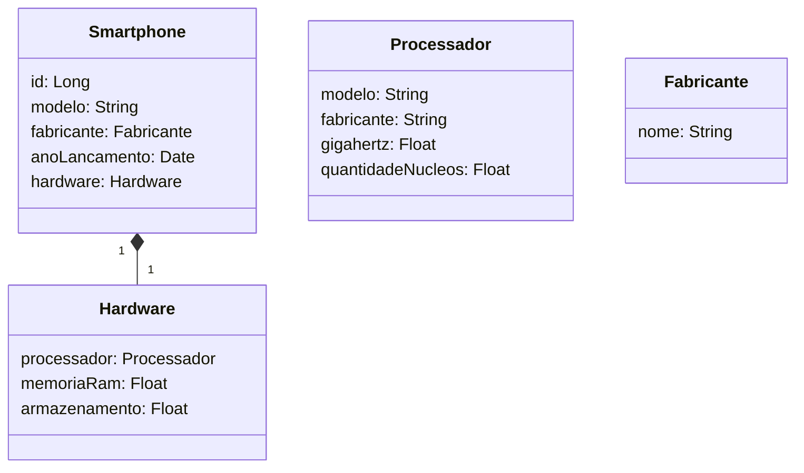

## Diagrama UML em formato Mermaid: 


### URL do Swagger
URL Swagger: localhost:8080/swagger-ui/index.html

## Schema de exemplo para inserção de um Smartphone
URL (POST): localhost:8080/api/v1/smartphone

```json
{
  "modelo": "Galaxy S20",
  "fabricante": {
    "nome": "Samsung"
  },
  "anoLancamento": "2020-02-11",
  "hardware": {
    "processador": {
      "modelo": "Exynos 990",
      "fabricante": "Samsung",
      "gigahertz": 2.7,
      "quantidadeNucleos": 8
    },
    "memoriaRam": 8,
    "armazenamento": 256
  }
}

```

### Outras informações
- Desenvolvida com Java 20
- Spring boot 3.1.3
- Maven 
- JPA
- H2 Database (Ambiente de desenvolvimento)
- PostgreSQL (Ambiente de produção, em breve)
